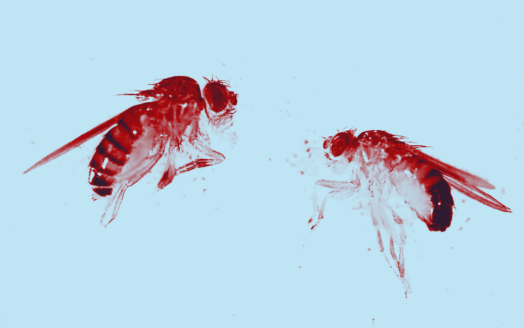
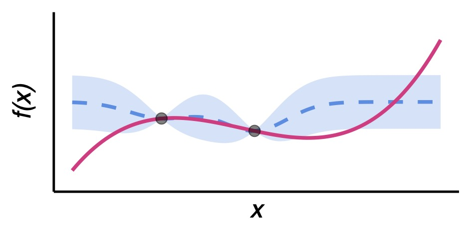

## 1. How does environmental heterogeneity influence the genomic footprint of adaptation?

  
  
  Understanding how organisms adapt to rapidly changing environments is crucial, especially in the context of global climate change. Adaptation often involves evolutionary trade-offs, where adjusting to one challenge, such as insecticides, may affect other traits like heat tolerance. My research investigates how environmental heterogeneity influences the spread of adaptive mutations, considering these pleiotropic effects. In this context, classic population genetic models only provide limited insights as they assume random mating and spatial homogeneity. To address this, I employ individual-based simulations and statistical frameworks to explore how environmental heterogeneity shapes the genomic footprint of insecticide resistance and affects adaptation dynamics across time and space. 
  

## 2. How Does Purifying Selection Shape Transposable Element Invasions?

  
  
 
    I study transposable elements (TEs), DNA sequences that can replicate within their host genomes. While the underrepresentation of TEs in coding regions suggests that purifying selection acts against new insertions, little is known about the balance between mutational pressure from TEs and the selection opposing them. My research investigates the distribution of fitness effects of new TE insertions in D. simulans, using experimental evolution combined with statistical emulation. Focusing on the P-element, a well-known TE in Drosophila species, I show that most P-element insertions are deleterious and subject to strong purifying selection. This work highlights the power of combining experimental evolution, individual-based modeling, and machine learning to uncover the complex dynamics of TE invasions.
      
    <a href="https://www.biorxiv.org/content/10.1101/2024.12.17.628872v2" target="_blank">Click here to access the preprint</a>
  

## 3. How does population structure influence host-pathogen dynamics in mosquito-transmitted diseases?

  
  
 Advancements in computational power and agent-based simulation frameworks have enabled more realistic modeling of mosquito-transmitted diseases, such as dengue, which affect millions of people every year. Despite their realism, these models are often outperformed by simpler mathematical models in disease forecasting. This gap may be due to our limited understanding of how spatial dynamics should be modeled. I develop an dengue-inspired individual-based disease transmission model that accounts for social structure, seasonality, and human mobility and apply Gaussian Process emulation to rapidly predict key outcomes, such as outbreak probability, peak incidence, and epidemic duration, across a broad parameter space. By calibrating the Gaussian Proccess model with data from over 1,000 dengue epidemics in Colombia, I identify critical drivers of dengue dynamics and pinpoint areas for targeted public health interventions. This approach highlights the potential of statistical emulation to make complex, realistic epidemiological models more accessible and effective for disease prediction and control.
      
    <a href="https://www.medrxiv.org/content/10.1101/2024.11.28.24318136v1" target="_blank">Click here to access the preprint</a>
  

