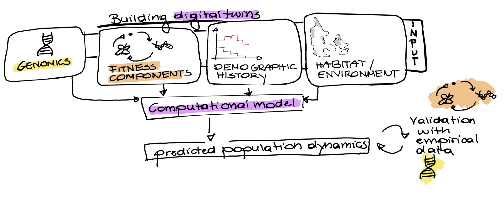
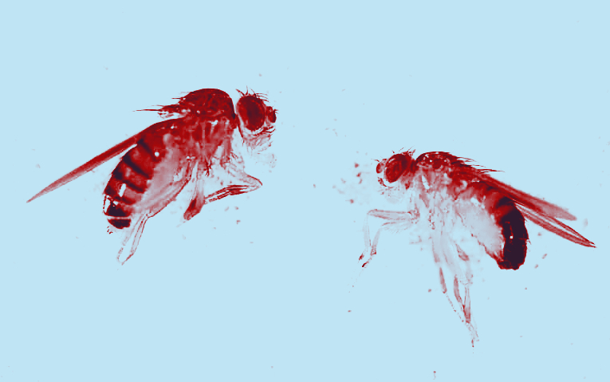

## 1. How does environmental heterogeneity influence the genomic footprint of adaptation?

  
  

    Photo credit: Elisabetta Ferrari
  

  

Understanding how organisms adapt to rapidly changing environments is crucial, especially in the context of global climate change. Adaptation often involves evolutionary trade-offs, where adjusting to one challenge, such as insecticides, may affect other traits like heat tolerance. My research investigates how environmental heterogeneity influences the spread of adaptive mutations, considering these pleiotropic effects. In this context, classic population genetic models only provide limited insights as they assume random mating and spatial homogeneity. To address this, I employ individual-based simulations and statistical frameworks to explore how environmental heterogeneity shapes the genomic footprint of insecticide resistance and affects adaptation dynamics across time and space.

As part of this work, I collaborate with the [Center for Ecological Genetics at Aarhus University]([https://ecogenetics.au.dk/?utm_source=chatgpt.com](https://bio.au.dk/en/research/research-centres/centre-for-ecological-genetics)) to study the distribution of insecticide resistance mutations across arthropod populations in Denmark. Using genomic data from more than 25 arthropod species sampled across agricultural and natural habitats, we investigate how resistance mutations vary across landscapes and environmental gradients, including temperature and land use.

## 2. When can genomic data predict population persistence?

  

Predicting whether populations can persist under environmental change is a major challenge in ecology and conservation biology. Genomic data are increasingly used to estimate extinction risk and adaptive potential, but it remains unclear when they actually improve predictions beyond ecological information alone. My research addresses this question by combining genomic data, fitness-related traits, and habitat information from natural butterfly populations within computational models.

The central idea behind this work is that genomic patterns only become informative when interpreted in the context of population history and environmental change. Similar levels of genetic diversity can arise from very different demographic histories and therefore imply different evolutionary futures. To investigate this, I develop eco-evolutionary “digital twins” that integrate genomic variation, habitat dynamics, and phenotypic data into individual-based simulation models. These models allow us to test whether genomic information improves predictions of effective population size, fitness-related traits, and population persistence across fragmented landscapes.

Using repeated sampling and time-resolved genomic data, the project directly compares predicted and observed population changes over time. More broadly, this work aims to move evolutionary genomics from describing patterns retrospectively toward predicting how populations respond to environmental change.

## 3. How does purifying selection shape transposable element invasions?

  
  
  

    Photo credit: Almorò Scarpa
  

I study transposable elements (TEs), DNA sequences that can replicate within their host genomes. While the underrepresentation of TEs in coding regions suggests that purifying selection acts against new insertions, little is known about the balance between mutational pressure from TEs and the selection opposing them. My research investigates the distribution of fitness effects of new TE insertions in <i>Drosophila simulans</i>, using experimental evolution combined with statistical emulation. Focusing on the P-element, a well-known TE in <i>Drosophila species</i>, I show that most P-element insertions are deleterious and subject to strong purifying selection. I am currently extending this work by investigating whether temperature affects the distribution of fitness effects of TE insertions. This work highlights the power of combining experimental evolution, individual-based modeling, and machine learning to uncover the complex dynamics of TE invasions.

  <a href="https://doi.org/10.1186/s13059-025-03688-2" target="_blank">
    Click here to access the publication
  </a>

