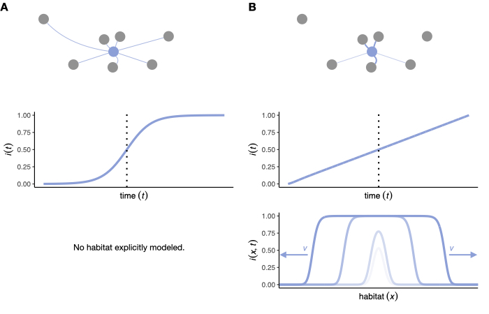

[Download paper here](https://www.sciencedirect.com/science/article/pii/S0040580924001072?via%3Dihub)

# Catching a wave: On the suitability of traveling wave solutions in epidemiological modeling 

Imagine you’re a scientist, and you want to study how disease dynamics unfold across space and through time. How would you start? Not, I hope, with unapproved releases of a new virus in your home town. Rather, you would start your research with a mathematical model. You would define some specific rules about how your disease propagates in your theoretical population, and then you would study the resulting dynamics, looking at the consequences of your chosen rules – how fast does it spread, and what spatial patterns of infection develop? You might do this either with the help of pen and paper, or with some keyboard strokes on your laptop. But which mathematical model should you choose? The answer depends on your specific research question and the disease you want to study.

Let’s start with a simple example. Imagine you’re interested in a disease that’s transmitted via direct contacts. Once an individual becomes infected, it can never recover from the disease (brutal, I know). This means that all members of your theoretical population are either susceptible, or infectious. If you assume that infection is a “global process”, the proportion of infectious individuals grows logistically with time (Figure 1A). But what does it mean for infection to be a “global process”? It means that all susceptible individuals have the same probability of contracting the disease at a given time (based upon the fraction of individuals that are infectious), regardless of where they are in space. Obviously, we know that this is not how disease transmission works in the real world, right? (Otherwise – where have you been since 2020?) It is far more likely that you will contract a disease from people that are nearby. Disease transmission is a local process, not a global process. OK – but then how should we account for this spatial component of disease transmission? There are many ways to incorporate spatial structure into your disease model, from modeling multiple theoretical populations that are connected to each other, to elaborate individual-based simulations (more on them later), but for now we will focus on an approach that has, since its introduction in the 1930s[^1],[^2],  become a workhorse of mathematical biology: the reaction–diffusion model. 

Imagine your individuals live in a continuous spatial habitat that is large compared to their day-to-day movements. Let’s assume that individuals move randomly and rarely travel over large distances (their dispersal kernel is exponentially bounded). In this case, you can use a reaction–diffusion model to describe disease dynamics not only as a function of time, but also of space. In a reaction–diffusion model, the change in the proportion of infectious individuals is represented by a “reaction” term that treats disease transmission as a local process dependent on the local frequencies of infectious and susceptible individuals, and a “diffusion” term that uses a diffusion coefficient _D_ to describe how quickly individuals disperse across their habitat. Due to the localized infection process in reaction–diffusion models, the disease often advances in the form of a traveling wave with a constant and well-defined velocity (Figure 1B). In a two-dimensional reaction–diffusion model in which individuals have no preferred direction of travel, the disease will advance from its initial introduction point in the shape of a circle, its radius growing at a constant velocity. 

But why should we bother to account for this extra complexity – space? Isn’t a model that treats infection as a global process sufficient to describe disease dynamics? In truth, that is often true; space does not always matter. The crucial question, however, is: when exactly does limited individual dispersal start to affect disease dynamics, such that spatial structure needs to be considered? 

<figure>
  
  <figcaption> Figure 1. Schematic plots of expected disease spread under the logistic-growth and the reaction–diffusion models. (A) The logistic-growth model assumes a global infection process: all susceptible individuals (grey dots) have an equal probability of contracting the disease from an infectious individual (blue dot). In the logistic-growth model the frequency of infected individuals, i(t), increases logistically. The vertical dashed lines represent the time at which 50% of the population is infected. (B) In the reaction–diffusion model, infection is treated as a local process and the overall frequency of infected individuals increases linearly. In the reaction–diffusion model for a one-dimensional habitat, the disease spreads from an initial release at the center of the habitat via two traveling waves with constant velocity in both directions.
  </figcaption>
</figure> 

In our paper _“Catching a wave: on the suitability of traveling-wave solutions in epidemiological modeling”_[^3], we derived a simple threshold for the diffusion coefficient _D_ below which we expect spatiality to strongly affect disease dynamics. To confirm our expectations, we turned our attention to individual-based simulations, in which each individual organism in our soon-to-be-infected population is modeled explicitly. We implemented our individual-based simulations in SLiM 4[^4] , an individual-based evolutionary simulation framework. We restrained ourselves from using the evolution part (for now), but the scriptability of SLiM 4 still allowed us to smoothly transition from spatially unstructured to highly structured populations by varying _D_. What was exciting to see was that when we systematically decreased the diffusion coefficient _D_ (making the infection process more and more “local”), the epidemic duration (the time until everybody got infected) of our simulated disease started to change, right around the critical threshold we had predicted. For unstructured populations, the fixation times are independent of _D_ and are well approximated by a logistic growth function. If the diffusion coefficient falls below the critical threshold, the epidemic duration becomes inversely proportional to the amount of individual dispersal, as expected for a reaction–diffusion model.

Individual-based simulations are without a doubt helpful when it comes to testing your predictions but modeling a reaction–diffusion process that treats individuals as a continuous density with a finite number of individuals instead comes with its own challenges. In an individual-based simulation, it is rather unlikely that two individuals are at exactly the same position at the same time, such that a new infection would occur. To transition from a continuous mathematical model to a discrete individual-based simulation model, we introduced an interaction radius: the maximum distance at which two individuals can still infect each other. In our simulations, this resulted in the disease being able to spread by hopping between individuals with overlapping interaction areas, even if the individuals themselves move little or not at all. 

In the last part of our paper, we studied the effect of limited individual dispersal on epidemics where infectious individuals can recover from the disease (yay). We modeled two different recovery scenarios. In the first scenario, individuals transition back to the susceptible state after infection. In the second scenario, individuals gain life-long immunity after they recover from the disease. This means that in contrast to our simple example from above not all individuals inevitably become infected. Even if we account for recovery, we observe that once _D_ falls below the critical threshold the shape and duration of these simulated epidemics start to change.

At this point, I think it is only fair to emphasize again that the applicability of reaction–diffusion models hinges on several assumptions: disease transmission is considered a highly local process, the infection probability is solely dependent on the local frequencies of individuals grouped by their respective disease states, and individual dispersal is small relative to the habitat range. These assumptions are key for the suitability of reaction–diffusion models to accurately describe the dynamics of real-world epidemics. In our paper, we discuss why the reaction–diffusion model is a reasonable choice for studying some diseases – the spread of the Black Death across medieval Europe[^5], for example, or a potential rabies outbreak in the UK[^6]  – but not for many other epidemiological scenarios. For example, if long-range dispersal is frequent, as is the case for wind-dispersed plant pathogens, avian influenza, or modern humans, conventional reaction–diffusion models can grossly underestimate the speed of disease propagation, because long-range migrants can seed new centers of infections that ultimately accelerate the spread of a disease beyond a constant velocity. 

In conclusion, our study highlights the need for careful interpretation and understanding of spatial factors in epidemiological dynamics, while also demonstrating the complexities and design choices that arise in modeling such dynamics.

And now it is time to become a scientist studying disease dynamics yourself! I made all our disease model implementations publicly available on [GitHub](https://github.com/AnnaMariaL/SpatialDieaseSim). To run these models, you just need to install [SLiM 4](https://messerlab.org/slim/), which is open-source software with a graphical user interface that runs on macOS, Linux, and Windows for easy setup. Short movie clips of example simulation runs are available on [YouTube](https://tinyurl.com/bdddam58). If I have sparked your interest, you can find our paper in [Theoretical Population Biology](https://doi.org/10.1016/j.tpb.2024.12.004). 

This project has received funding from the European Union’s Horizon2020 research and innovation program under the Marie Skłodowska-Curie grant agreement No. 101025586. Special thanks to all Messer lab members for fruitful discussion and support, and to Benjamin C. Haller for being really groovy and providing valuable feedback on this blog post. 

[^1]: Fisher (1937)
[^2]: Kolmogorov _et al._ (1937)
[^3]: Langmüller _et al._ (2024)
[^4]: Haller & Messer (2023)
[^5]: Noble (1974)
[^6]: Murray _et al._ (1986)
